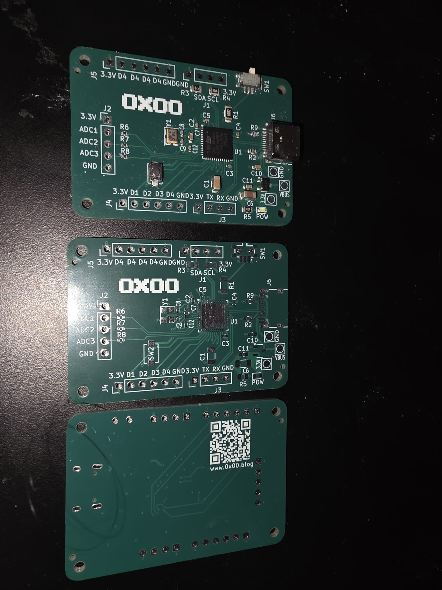
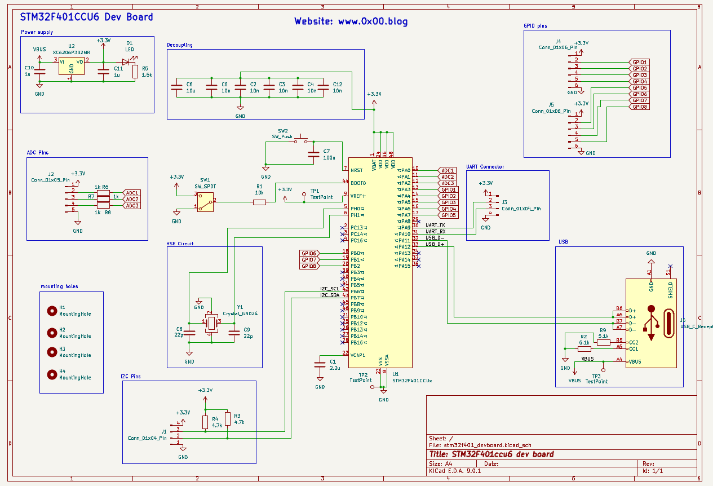
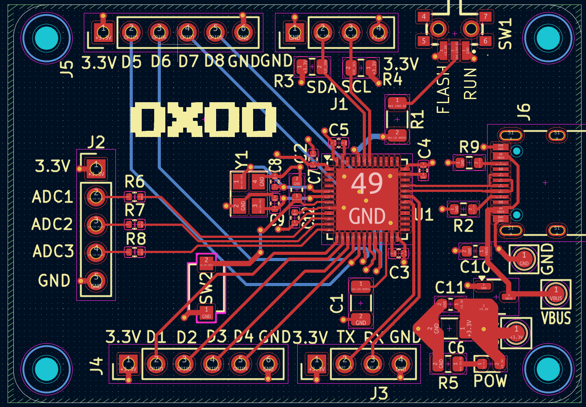
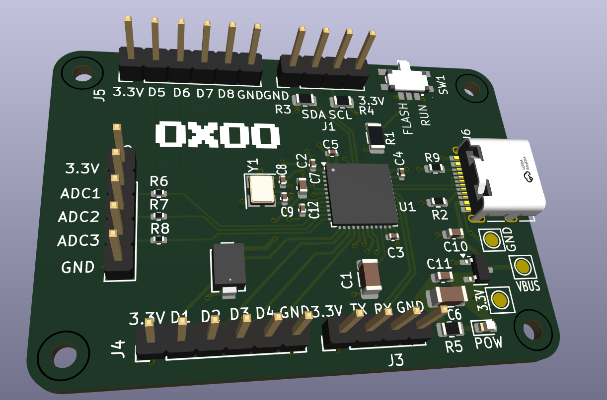
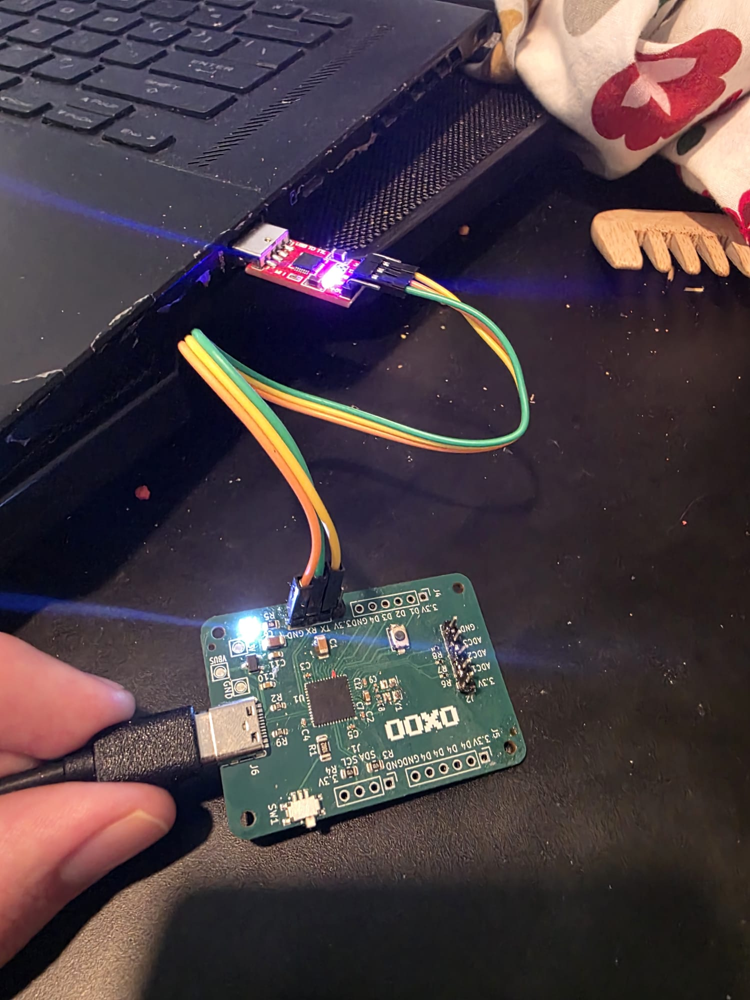

# Custom Designed STM32F401CCU6 Dev Board
This is a 4 layer STM32F401CCU6 Dev Board I designed and sent for fabrication and assembly at JLCPCB 
the picture of the board's front and back: 
 
It still has a few problems I mentioned later in this document.
## Schematic and pcb layout
the board was designed with kicad. It has 4 layers including a ground plane, power plane and 2 signal layer. 
circuit schematic: 
 
a view of pcb layout: 
 
Kicad 3d viewer: 

## Problems with this version
Since the design was rushed and this being my first microcontroller design there are a few problems with this version I'm trying to solve in later iterations.  
1. Wrong oscillator and USB connection
I chose the wrong oscillator for the board's high speed clock. and since stm32's usb connection requires a clock multiple of 1MHz to establish a USB connection, this board is unable to interact through USB. 
And since I didn't add a SWD connector, the only way to program the board is with a UART to USB connector connected to the board's UART pins. 
But the board still needs to be powered by USB. 
Here's a picture of the board connected to my laptop through a UARD-to-USB module: 
  
2. there are a few mistakes on the silkscreen  
3. the position files are auto generated and I had to adjust them before sending for assembly
## Video
See this youtube video for more information about this project: 
https://www.youtube.com/shorts/pBtifo1SFRY
